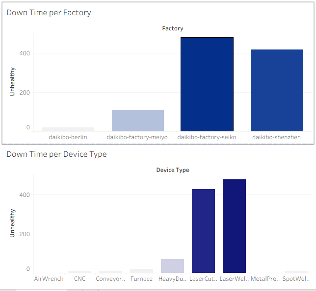

# Machine-Downtime-Analysis-Dashboard


> **Tools:** Tableau Public, Microsoft Excel  
> **Project Type:** Data Visualization & Business Intelligence  
> **Program:** Deloitte Data Analytics Virtual Experience (Forage)

---

# Project Overview

This project was completed as part of the **Deloitte Data Analytics Virtual Experience Program on Forage**.

The objective was to analyze machine health data from multiple manufacturing facilities to identify operational inefficiencies caused by machine downtime. Using Tableau, I transformed raw machine status data into an interactive dashboard that enables stakeholders to quickly identify high-risk factories and frequently failing machine types.

---

# Business Problem

Unexpected machine failures can significantly reduce production efficiency, increase maintenance costs, and delay manufacturing operations.

This project aims to answer two key business questions:

- Which factory experienced the highest machine downtime?
- Which machine types contributed most to downtime in that factory?

The insights can support maintenance teams in prioritizing preventive maintenance and improving operational reliability.

---

# Dataset Overview

The dataset contains machine health records collected at regular time intervals across multiple factories.

[Dataset](Dataset/data.json.zip)

### Variables

| Variable | Description |
|----------|-------------|
| Factory | Manufacturing location |
| Device Type | Machine category |
| Status | Machine condition (Healthy / Unhealthy) |
| Timestamp | Time of machine status recording |

Each **Unhealthy** status represents **10 minutes of machine downtime**, allowing total downtime to be calculated using a Tableau calculated field.

---

# Methodology

The analysis followed these steps:

1. Explored and validated the dataset.
2. Created a calculated field to convert machine status into downtime (minutes).
3. Aggregated downtime by factory.
4. Analyzed downtime by device type.
5. Designed an interactive Tableau dashboard for business users.

---

# Dashboard

### Interactive Dashboard

**🔗 Tableau Public**

> **[Paste your Tableau Public link here](https://public.tableau.com/views/ManufacturingDowntimeAnalysis_17831773006660/Dashboard1?:language=en-US&:sid=&:redirect=auth&:display_count=n&:origin=viz_share_link)**

---

### Dashboard Preview



---

# Key Insights

- **Seiko** recorded the highest total machine downtime among all factories.
- Certain machine types contributed disproportionately to downtime within the affected factory.
- Downtime patterns differed across manufacturing locations, suggesting that maintenance priorities should vary by factory.

---

# Business Recommendations

Based on the analysis, the following actions are recommended:

- Prioritize preventive maintenance in factories with the highest downtime.
- Monitor high-risk machine types more frequently.
- Implement predictive maintenance using historical machine health data.
- Develop automated alerts for recurring machine failures to reduce production interruptions.

---

# Skills Demonstrated

- Data Visualization
- Business Intelligence
- Dashboard Design
- Calculated Fields (Tableau)
- Data Aggregation
- Data Storytelling
- Business Insight Generation

---

# Repository Structure

```
machine-downtime-analysis-tableau/
│
├── data/
│   └── machine_health_data.xlsx
│
├── dashboard/
│   └── Machine_Downtime_Dashboard.twbx
│
├── images/
│   └── dashboard.png
│
└── README.md
```

---

# How to Use

1. Open the interactive Tableau dashboard using the Tableau Public link above.
2. Explore downtime by factory and device type.
3. Use the visualizations to identify operational trends and maintenance priorities.

---

# Acknowledgement

This project was completed as part of the **Deloitte Data Analytics Virtual Experience Program** hosted on **Forage**. The analysis, dashboard design, and interpretation presented in this repository are my own work.
